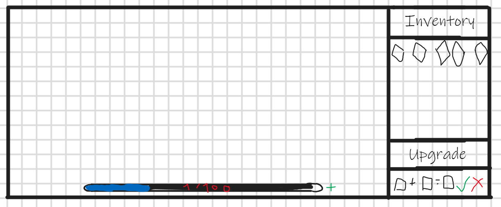

# TODO

## Mécanisme du jeu

### Descriptif du projet

- Grille 28*22
- Taux de rafraichissement : 60Hz
- Mana (fait aussi PV)
- Score = nb vague + degat

### Vague

- toute les 35 secondes (possibilité de skip le timer (+ t% de la capa total de la réserve ))

- Vague normale : 12 monstres, vitesse d’une case par seconde (50%)
- Vague de foule : 24 monstres, vitesse d’une case par seconde (20%)
- Vague agile : 12 monstres, vitesse de deux cases par seconde (20%)
- Vague de boss : 2 monstres, vitesse d’une case par seconde (10%) (pas dans 5 prems)

HP des monstres : h *1.2^i (h = constante, i = numéro de la vague)
HP des boss : 12* h  * 1.2^i

### Mana

De base rempli à 150/2000.
Mana Pool : 2000 *1.4^n (n = niveau (start à 0))
Price upgrade : 25% max reverse (500* 1.4^n)

Gain mana = 10% (hp max mob) * 1.3^n (n = niveau reserve)

- Perte (banissement):
    TP mob au debut (garde ses hp actuel) + perte mana =  15% (hp max mob) * 1.3^n (n = niveau reserve)

- Prix tour 100 (2x a chaque nouvelle tour)
    3 tours offertes au début
    100*2^(k-4) (k = nombre de tours posées + 1)

- Prix gemme :
  - 100 * 2^n (n = niveau gemme)
  - 100 l'upgrade

Si plus de mana = LOSE

### Gemmes/Tours

Impossible de détruire une tour

- Une tour ne tire pas si elle n’a pas de gemme
- On peut placer et remplacer les gemmes
- Chargement de 2 secondes pour mettre une gemme
- 2 tir par secondes max
- Rayon 3 cases (focus plus d'HP)
- Teinte de la gemme -> int de 0 à 359
- Les gemmes possède un niveau
- degat : d × 2^n × (1 − cos(tg − tm)/2) (d = constante / n = niveau gemme / tg = teinte gemme / tm = teinte mob )
- 2 types de gemmes
  - Gemme pure :
    rouge : teinte 0–30 et 330–359, élément Pyro
    vert : teinte 90–150, élément Dendro
    bleu : Bleue, teinte 210–270, élément Hydro

  - Gemme mixte :
    Pas d'effet d'élement
    Dégats doublé + 10% de redoubler à la fusion

- Le joueur ne peut créer que des gemmes pures (cout: 100*2^n (n = niveau gemme))

- Fusion de gemmes :
  - même niveau
  - genere niveau n + 1
  - prix 100 mana
  - median des 2 teintes
  - Garde son type pure si les 2 gemmes sont pures (aka R+R, V+V, B+B) sinon mixte

### Elements

- Pyro : 15% de dégat de base aux monstres (rayon 2 cases autour de l'atterissage)
- Dendro : 2.5% de dégat de base toutes les 5s (pendant 10s)
- Hydro : Vitesse divisé par 1.5 (pendant 10s)

- Residu elem :
  - 1er tire donne résidu elem
  - refrappe même element reset chrono
  
  - 2 elem different retire elem + applique :
  - pyro + hydro = 5% dans rayon 3.5 case + 1.25 (5sec)
  - pyro + dendro = 3x degat du tir courant
  - dendro + hydro = pas bouger pendant 3s

## Génération de chemin

A voir dans le doc partie 3 (page 5,6)

## Mouvements

- Calculs de mouvements à réaliser avec des floats pour être plus précis
- Monstres apparaissent à 1 seconde de décalage (sauf agile et foule 0.5s)
- Déplacement centre à centre
- vitesse : entre 0.9 × v/60 et 1.1 × v/60
- vitesse tir 3case /s
Suite a regarder dans le doc partie 4 (page 7)

## Interface

- afficher grille en permanance
- barre mana
- inventaire
- gestionnaire d'upgrade

